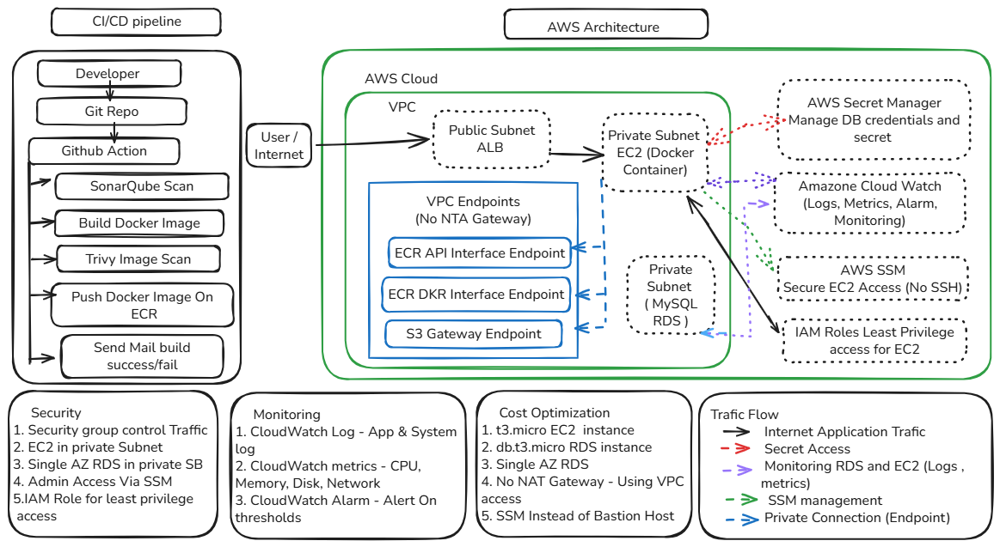

# DevOps Engineer Take Home Assessment

## Overview

This repository contains the solution for the DevOps Engineer Technical Assessment.

The implementation includes:

* AWS architecture design
* Terraform infrastructure provisioning
* Linux operational scripting

---

# Part 1 – AWS Architecture & Security Design

## Architecture Diagram



## Architecture Summary

The architecture is designed for a containerized web application running on AWS.

### Components

* VPC
* Public Subnet
* Private Subnet
* Application Load Balancer (Architecture Design)
* EC2 Instance (Application Host)
* MySQL RDS
* Amazon ECR
* AWS Systems Manager (SSM)
* AWS Secrets Manager (Recommended for Production)
* Amazon CloudWatch
* IAM Roles

### Traffic Flow

Internet User
→ Application Load Balancer
→ EC2 Application Server
→ MySQL RDS

### Security Design

* Application server deployed in private subnet
* Database deployed in private subnet
* No direct database access from internet
* Administrative access through AWS Systems Manager (SSM)
* IAM Roles used instead of static credentials
* Database access restricted through Security Groups

### Monitoring Strategy

* CloudWatch Logs
* CloudWatch Metrics
* CloudWatch Alarms

### Secrets Management

For this assessment, database credentials are supplied through Terraform variables and marked as sensitive values.

In a production environment, AWS Secrets Manager would be used to securely store and manage database credentials.

### Cost Optimization

* Single public subnet
* Single private subnet
* t3.micro EC2 instance
* db.t3.micro RDS instance
* Single-AZ deployment
* No NAT Gateway
* SSM used instead of Bastion Host
* VPC Endpoints used instead of NAT Gateway (ECR API, ECR DKR, S3 Gateway)

---

# Part 2 – Terraform Implementation

## Components Provisioned

Terraform provisions:

* VPC
* Public Subnet
* Private Subnet
* Internet Gateway
* Route Tables
* Security Groups
* EC2 Instance
* IAM Role
* IAM Instance Profile
* AWS Systems Manager Access
* MySQL RDS
* DB Subnet Group

## Terraform Structure

```bash
Terraform/
├── modules/
│   ├── vpc/
│   ├── security_group/
│   ├── ec2/
│   └── rds/
├── remote-backend/
├── provider.tf
├── variables.tf
├── outputs.tf
└── main.tf
```

## Remote State Management

Terraform state is stored in Amazon S3.

State locking is implemented using DynamoDB.

## Prerequisites

- Terraform >= 1.5
- AWS CLI configured
- AWS account with appropriate permissions

## Deployment

Initialize Terraform:

```bash
terraform init
```

Code Formatting:

```bash
terraform fmt -recursive
```

Validate Configuration:

```bash
terraform validate
```

Create Execution Plan:

```bash
terraform plan
```

Deploy Infrastructure:

```bash
terraform apply
```

Destroy Infrastructure:

```bash
terraform destroy
```

---

# Assumptions Made

* AWS credentials are already configured.
* The assessment requested one public subnet and one private subnet.
* MySQL was selected as the relational database engine.
* EC2 administrative access is provided through AWS Systems Manager instead of a Bastion Host.
* For simplicity, database credentials are provided through Terraform variables.
* In production, AWS Secrets Manager should be used for secret storage and rotation.
* The architecture diagram includes an Application Load Balancer for production readiness, although ALB provisioning was outside the explicit Terraform scope.
* A single private subnet is used for both EC2 and RDS as per assessment requirements.
* In a production environment, RDS should use multiple private subnets across Availability Zones.

---

# Design Decisions

* Modular Terraform structure used for reusability and maintainability.
* IAM Roles used instead of long-term credentials.
* SSM chosen instead of SSH/Bastion Host to reduce attack surface.
* Private subnet used for application and database workloads.
* CloudWatch selected for centralized monitoring.
* Amazon ECR selected for container image storage.
* VPC Endpoints used for private ECR access without NAT Gateway
---

# Tradeoffs Considered

* NAT Gateway was not deployed to reduce cost.
* Single-AZ deployment selected for simplicity and cost optimization.
* Minimal infrastructure was provisioned based on assessment requirements.
* ALB was included in architecture design but not provisioned through Terraform because it was not explicitly requested.

---

# Part 3 – Linux & Scripting Task

## Script

health_check.sh

## Features

* Checks disk utilization
* Checks memory utilization
* Checks Docker service status
* Generates timestamped log files
* Returns non-zero exit code when disk usage exceeds 80%

## Run Script

chmod +x health_check.sh

./health_check.sh

## Output

The script creates a timestamped log file:

```text
health_check_20260623_011951.log
```

Sample log output:

```text
System Health Check
Time: Tue Jun 23 01:19:51 AM IST 2026

Disk Usage:
...
Current Disk Usage: 39%

Memory Usage:
...
Docker Status: Running

Disk usage is normal
```

Exit Codes:

- 0 = Disk usage is 80% or below
- 1 = Disk usage exceeds 80% or log file creation fails